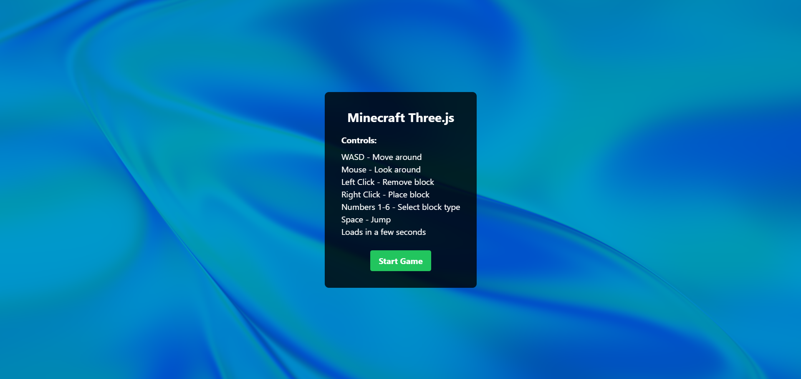
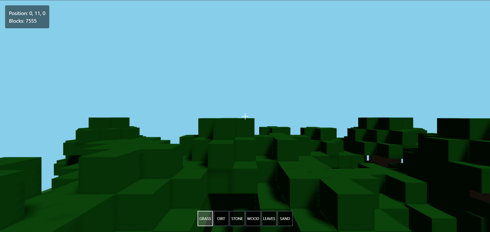

# Minecraft Three.js

A web-based Minecraft clone built with React and Three.js, featuring block-based world generation and physics-based movement.

<div style="text-align: center;">
  
</div>

<div style="text-align: center;">
  
</div>

## Features

- **3D Block World**: Procedurally generated 32x32 terrain with 6 block types
- **Interactive Gameplay**: Place/remove blocks, first-person controls, jump mechanics
- **Custom Physics**: Gravity, collision detection, ground detection
- **Visual Effects**: Dynamic lighting, shadows, fog rendering

## Controls

- **WASD**: Move | **Mouse**: Look around | **Space**: Jump
- **Left Click**: Remove block | **Right Click**: Place block
- **Numbers 1-6**: Select block type

## Quick Start

https://3js-minecraft.vercel.app/

or

```bash
git clone https://github.com/yourusername/minecraft-threejs.git
cd minecraft-threejs
npm install
npm run dev
```

Open http://localhost:3000 to play!

## Tech Stack

- React + Three.js + Tailwind CSS
- Custom JavaScript physics engine
- Procedural world generation with random terrain and trees

Built as a web-based 3D voxel game with real-time block manipulation and immersive first-person gameplay.